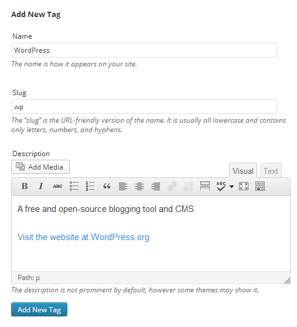
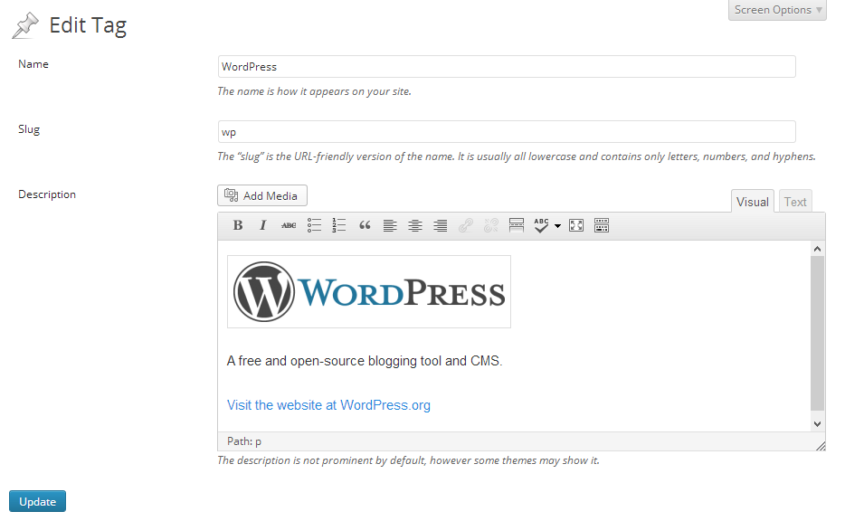
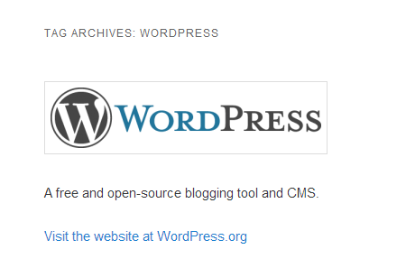

# Visual Term Description Editor

* __Requires at least:__ WordPress 3.3 or later
* __Tested up to:__ WordPress 4.5.2
* __Stable version:__ 1.5.0
* __License:__ [MIT](http://opensource.org/licenses/MIT)

Replaces the term description editor with the WordPress TinyMCE visual editor, allowing you to use HTML in term descriptions and write them in rich text. Works on all taxonomies, including tags, categories and link categories, as well as custom taxonomies.

This plugin is multisite-compatible; if you would like to use it on every blog, network activate the plugin from the network dashboard. Otherwise, activate the plugin for individual sites.

## Installation

1. Upload `visual-term-description-editor.php` to the `/wp-content/plugins/` directory
2. Activate the plugin through the 'Plugins' menu in WordPress
3. Done!

## Screenshots

### Adding a new tag using the visual editor

### Editing a tag using the visual editor

### Viewing a tag archive page with the formatted tag description (using the Twenty Fourteen theme)

